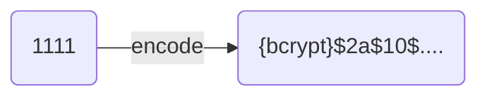

# 회원 인증 시스템

## Config 구조 설명

### UserDetailsService

```java

@Bean
public UserDetailsService userDetailsService() {
	UserDetails user = User
			.withUsername("user")
			.password("{noop}1111")
			.roles("USER")
			.build();
	return new InMemoryUserDetailsManager(user);
}
```

Spring Security에서 사용자 인증을 위한 기본 사용자 계정을 설정하는 부분이다.
기본 사용자 계정은 애플리케이션 실행 시 초기화 과정에서 미리 정의된 사용자 계정을 의미한다.
이런 계정은 애플리케이션에서 인증 기능을 테스트하거나 설정을 간편하게 하기 위해 사용된다.

### UserDetailsService

Spring Security가 사용자 인증 시 사용자 정보를 로드하는 데 사용하는 서비스 인터페이스이다.

### UserDetails

Spring Security에서 사용자 정보를 나타내는 인터페이스이다.

- `.withUserName("user)` : 사용자의 id를 "user"로 설정
- `.password("{noop}1111")` :
    - 사용자 비밀번호를 1111로 설정
    - `{noop}` : 암호화 없이 원문 그대로 비밀번호를 사용하겠다는 의미
- `.role("USER")` : 사용자의 역할을 "USER"로 설정

### PasswordEncoder

```java

@Bean
public PasswordEncoder passwordEncoder() {
	return PasswordEncoderFactories.createDelegatingPasswordEncoder();
}
```

비밀번호를 안전하게 저장하기 위해 비밀번호의 단방향 변환을 수행하는 데 사용한다.
사용자의 비밀번호를 암호화하여 저장하거나 인증 시 검증을 위해 입력한 비밀번호와 암호화 되어 저장된 비밀번호를 서로 비교해야 할 때 사용된다.

**DelegatingPasswordEncoder**  
`{id}` 형식의 접두사를 사용해서 비밀번호가 어떤 방식으로 인코딩되었는지 식별하는 클래스
