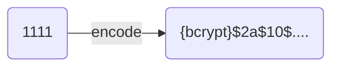

# 회원 인증 시스템

## Config 구조 설명

### UserDetailsService

```java

@Bean
public UserDetailsService userDetailsService() {
	UserDetails user = User
			.withUsername("user")
			.password("{noop}1111")
			.roles("USER")
			.build();
	return new InMemoryUserDetailsManager(user);
}
```

Spring Security에서 사용자 인증을 위한 기본 사용자 계정을 설정하는 부분이다.
기본 사용자 계정은 애플리케이션 실행 시 초기화 과정에서 미리 정의된 사용자 계정을 의미한다.
이런 계정은 애플리케이션에서 인증 기능을 테스트하거나 설정을 간편하게 하기 위해 사용된다.

### UserDetailsService

Spring Security가 사용자 인증 시 사용자 정보를 로드하는 데 사용하는 서비스 인터페이스이다.

### UserDetails

Spring Security에서 사용자 정보를 나타내는 인터페이스이다.

- `.withUserName("user)` : 사용자의 id를 "user"로 설정
- `.password("{noop}1111")` :
    - 사용자 비밀번호를 1111로 설정
    - `{noop}` : 암호화 없이 원문 그대로 비밀번호를 사용하겠다는 의미
- `.role("USER")` : 사용자의 역할을 "USER"로 설정

### PasswordEncoder

```java

@Bean
public PasswordEncoder passwordEncoder() {
	return PasswordEncoderFactories.createDelegatingPasswordEncoder();
}
```

비밀번호를 안전하게 저장하기 위해 비밀번호의 단방향 변환을 수행하는 데 사용한다.
사용자의 비밀번호를 암호화하여 저장하거나 인증 시 검증을 위해 입력한 비밀번호와 암호화 되어 저장된 비밀번호를 서로 비교해야 할 때 사용된다.

**DelegatingPasswordEncoder**  
`{id}` 형식의 접두사를 사용해서 비밀번호가 어떤 방식으로 인코딩되었는지 식별하는 클래스



## Filter Config

- 스프링 시큐리티는 HttpSecurity 설정을 통해 어플리케이션의 보안 요구사항에 맞게 필터 체인을 추가 할 수 있게 해준다.

### 필터 추가

- addFilterBefore
    - 지정된 필터를 필터 체인의 특정 필터 이전에 추가하며 주로 특정 처리가 다른 필터보다 먼저 실행되어야 할 때 사용

```java
      http.addFilterBefore(new CustomFilter(),UsernamePasswordAuthenticationFilter.class);
```

- addFilterAfter
    - 지정된 필터를 필터 체인의 특정 필터 이웋에 추가하며 특정 작업이 다른 필터의 처리를 따라야 할 때 사용

```java
      http.addFilterAfter(new CustomFilter(),UsernamePasswordAuthenticationFilter.class);
```

- addFilter
    - 시큐리티 필터 체인에 새로운 필터를 추가하며 필터의 위치를 지정하지 않고 필터의 유형에 따라 자동으로 적절한 위치에 필터를 추가
    - 추가하는 필터가 스프링 시큐리티의 필터를 상속받을 경우에 대항하며 그렇지 않을 경우 예외 발생

```java
    http.addFilter(new CustomFilter());
```

- addFilterAt()
    - 지정된 필터를 필터 체인의 특정 필터 위치에 추가하며 특정 필터를 대체하지는 않는다.

```java
    http.addFilterAt(new CustomFilter(),UsernamePasswordAuthenticationFilter.class);
```

## h2 인메모리 설정시 콘솔 접근하는 방법

- csrf 보호를 사용중이다
- X-Frame-Options 헤더를 사용중이다

위 두가지 설정을 유지해야 하는 극악의 환경일 때 h2 콘솔에 접근하는 방법

```java

@Bean
public SecurityFilterChain securityFilterChain(HttpSecurity http) throws Exception {
	http
			.csrf(csrf -> csrf.ignoringRequestMatchers("/h2-console/**")) 
            // 해당 경로는 csrf 보호를 사용하지 않음
			.headers(headers -> headers.frameOptions(HeadersConfigurer.FrameOptionsConfig::sameOrigin))
            // 동일 출처에서만 프레임을 허용
			.authorizeHttpRequests(auth -> auth
					.requestMatchers("/h2-console/**")
					.permitAll() // 인증인가없이도 해당 경로 접근 가능 설정
                        ...
```